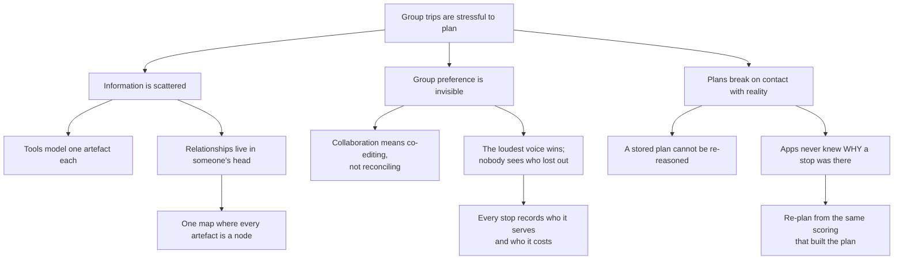
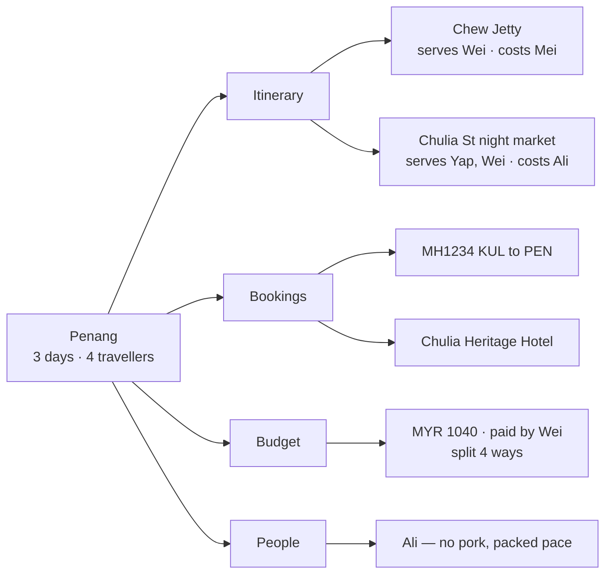
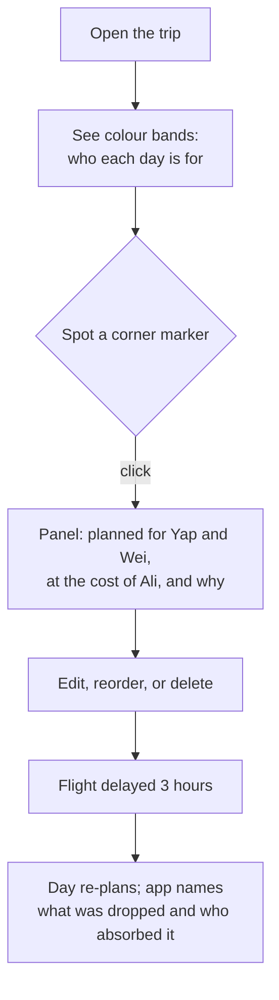

# [Project Name] by [Team Name]

**Team:** [Member 1], [Member 2], [Member 3], [Member 4]

**Problem Statement:** Travel Planner — Lifestyle Track, "Planning an Escape"

**Video Presentation:** [Unlisted YouTube Link]

**Presentation Slides:** [Public Link]

---

## 1. Project Overview

### The Problem

Planning a group trip is not one hard task, it is five easy ones that refuse to sit in the same place. Flights live in an airline app, the hotel in another, the budget in a spreadsheet, the itinerary in Notes, and everyone's actual opinions in a group chat that scrolls away. Nobody owns the whole picture, so nobody can see the trade-offs.

**The causes, as we understand them:**

- **Tools are built per-artefact, not per-trip.** Each app models one noun — a booking, a receipt, a day — so the relationships between them exist only in someone's head.
- **Group preference is treated as a scheduling problem.** Existing tools help four people agree on *when*. They do nothing about the fact that the itinerary someone agreed to is quietly terrible for them.
- **Plans are stored, not reasoned about.** When a flight slips three hours, the app shows you a plan that is now wrong. It cannot tell you what to drop, because it never knew why anything was there.

**Stakeholders:** the trip organiser (who currently absorbs all this work and the blame), the travellers who quietly get a worse trip than the loudest person in the chat, and — further out — the small operators whose places get skipped because nobody could fit them in.

**What exists, and why it falls short:**

| Tool | What it does well | Where it stops |
|---|---|---|
| **TripIt** | Parses confirmation emails into one timeline | A filing cabinet. No group preference, no budget reasoning, no re-planning |
| **Wanderlog** | Collaborative itinerary with maps and some budgeting | Collaboration means *co-editing*. It records that four people edited a plan, not whether the plan is good for four people |
| **Google Sheets + group chat** | Infinitely flexible, everyone already has it | Every relationship is manual. Nothing recomputes when reality changes |

None of them can answer the question a group trip actually turns on: **who is this stop for, and who is paying for it in something other than money?**

### Our Solution

A trip planner where **the mindmap is the application**, not a picture of it. Every part of the trip — a stop, a flight, a hotel, a budget line, a traveller — is a node you open for its full detail, on one screen that never navigates away. That is the direct answer to "scattered across five apps and a group chat".

The part that makes it more than a prettier itinerary: every stop records **who it was planned for**, **whose preference it sacrifices**, and **why** — in a plain sentence written for the traveller, not for an engineer. Node colours come from the people a stop serves, so who a day belongs to is legible at a glance, before anyone reads a word.

**Feature set:**

- **One centralised mindmap** — itinerary, bookings, budget and people as openable nodes on a single canvas
- **Preference-aware planning** — each stop carries `serves` / `conflicts` / `reason`; colour bands show who it is for, a corner marker shows where someone lost out
- **Full editing** — add, edit, delete and reorder stops, with validation, persisting locally
- **Three lenses over one trip** *(categories shipped; itinerary and people in the build phase)* — re-root the same data by category, by day, or by traveller
- **Budget and cost splitting** *(build phase)* — running spend against each person's cap, and who owes whom
- **Map view** *(build phase)* — the same stops as pins and day routes
- **AI explanations** *(build phase)* — a local algorithm decides; a model writes the human-readable reasoning
- **Disruption re-planning** *(build phase)* — "flight delayed 3 hours" recomputes the day and names what was dropped and who absorbed it

---

## 2. Ideation & Process

### 2.1 Ideas We Considered

Chosen ideas first, then what we dropped and why.

| Idea | Why it was dropped / kept |
|---|---|
| **Mindmap as the application (Chosen)** | Kept. The problem statement's own words are "scattered across five different apps and a group chat". A single canvas where every trip artefact is a node is the literal inverse of that. It also gives us one screen to design well rather than six to design adequately. |
| **`serves` / `conflicts` / `reason` on every stop (Chosen)** | Kept. This is the whole differentiator. Every competitor can store an itinerary; none can say who each choice was for and who paid for it. It costs three fields and buys the entire product story. |
| **Hybrid AI: local algorithm decides, model explains (Chosen)** | Kept. A deterministic scorer picks the plan, so it always works and is reproducible; the model turns that decision into a sentence a traveller would actually read. Fails safe — with no network or no key it falls back to pre-written text. |
| **Real re-planning on disruption (Chosen)** | Kept over a canned before/after. Recomputing from the same scoring that built the plan means the "who paid for this" answer is derived, not authored. |
| Static demo prop — four hardcoded screens, no real logic | **Dropped, and this was our biggest pivot.** We built it first. It looked fine and proved nothing; every interesting question ("what if we delete this?") had no answer. We rebuilt on a real domain model. |
| Two-fixture delay swap — hand-write the "after" itinerary | Dropped with the prop above. It demos identically and teaches us nothing, and it cannot survive a judge asking "what if the delay were two hours?" |
| Itinerary-first lens — days as the spine | **Deferred, not dropped.** Reads most like a real itinerary, but pushes budget and people off the map, which undercuts "everything in one place". Kept as a second lens. |
| People-centred lens — travellers as root nodes | **Deferred, not dropped.** Strongest on group preference, weakest on budget and bookings. Kept as a third lens. |
| Permanent split view — map left, detail right | Dropped. The mindmap would only ever get half the screen, weakening the one visual the whole pitch rests on. |
| Mindmap home + real routes for everything else | Dropped. The moment you navigate away it stops being one centralised map and becomes an ordinary app with a diagram on the front page. |
| Full AI generation — model produces the whole itinerary | Dropped. Slow, non-deterministic between runs, and dead without network. We would be demoing a loading spinner. |
| AI only at build time — pre-generate, ship static | Dropped. Honest, but there is no AI running when a judge clicks it. |
| No AI at all — pure scoring algorithm | Dropped as the sole approach. Defensible and robust, but a scoring function is not AI and we would not claim it was. |

### 2.2 Ideation Boards

**Problem tree — why trip planning fragments**

*What it shows: the three root causes we identified, and which part of our solution each one drove.*

**Product structure — what lives on the map**

*What it shows: the category lens as built. Every leaf opens into full detail; nothing is a label-only box.*

**User flow — the moment the product earns its keep**

*What it shows: the path from glanceable colour to the explanation panel to recovery. Steps E and F are where we spent our build effort, because they are what a stored itinerary cannot do.*

### 2.3 Mentor Consultation

| Date | Mentor | Feedback Received | What Was Changed |
|---|---|---|---|
| | | | |

---

## 3. Design & Prototype

**UI Prototype:** [Public Link — check it opens in an incognito window]

### The mindmap is the app

The whole trip on one canvas: the trip node branches into Itinerary, Bookings, Budget and People, and every leaf is openable. No navigation, no tabs — the thing the problem statement says is scattered across five apps is one screen here.

### Who a stop is for, at a glance

Each stop's left band is made of the colours of the people it serves — solid orange is Wei alone, blue-over-orange is Yap and Wei together. The corner slash marks a stop where somebody lost out. You can read who owns a day before reading a single word. The marker is deliberately a neutral slash rather than a red warning: a compromise is not an error.

### Who paid for it, and why

Opening a stop gives the time slot, duration and per-person cost, then the part no other planner has: **Planned for** Yap and Wei, **At the cost of** Ali, and a plain sentence — *"Covers Yap's street food and Wei's photo spots. Ali avoids pork, so his options here are limited."* Written for the traveller, not the engineer.

### Editing is real, not a mockup

Adding a stop captures the same fields the model reasons over, including who it is for and who it costs. Stops can be edited, reordered within a day, moved between days, and deleted; everything survives a reload.

### Validation that fails safe

Every problem is reported at once rather than one at a time, and a stop cannot be saved without at least one person it is for — because a stop nobody wants is the bug the whole product exists to prevent. Clearing a numeric field blocks the save rather than silently substituting a plausible default.

---

## 4. What Makes It Different

**1. The mindmap is the application, not a visualisation of it.**
Other tools show you a list and offer a map view. Here there is no underlying list — the map *is* the interface, and every trip artefact is a node with real detail inside it. That is the structural answer to "five apps and a group chat".

**2. Every decision records who it was for and who paid for it.**
`serves`, `conflicts` and `reason` are on every stop. No mainstream planner stores this, because they treat a group as a set of editors rather than a set of people with incompatible preferences. It is the difference between "four people agreed to this itinerary" and "this itinerary is good for Yap and Wei, and here is exactly what Ali gave up."

**3. Compromise is surfaced, not hidden.**
The corner marker and the "At the cost of" panel make the cost of every choice visible to the whole group. The quiet traveller who always gets overruled becomes visible in the interface.

**4. Re-planning is computed, not authored.**
When a flight slips, the day is recomputed by the same scoring that built the plan, so the app can say *what* was dropped and *whose* preference absorbed it. A stored itinerary physically cannot do this: it never knew why anything was there.

**5. Three lenses over one trip.**
The same data re-rooted by category, by day, or by traveller — because "what does this trip look like for Ali?" and "what does Tuesday look like?" are different questions with the same answer underneath.

---

## 5. Technical Architecture & Feasibility

### Tech stack

| Layer | Choice | Why | Constraint we expect |
|---|---|---|---|
| **Frontend** | React 19 + TypeScript + Vite | Team knows it; Vite's dev loop is fast enough to iterate on a visual product | None material |
| **Canvas** | `@xyflow/react` (React Flow v12) | Purpose-built for node graphs — panning, zooming and custom nodes solved for us. Building this on raw SVG would consume the whole build phase | v12 renamed from `reactflow`; import paths and CSS differ from v11, so older tutorials mislead |
| **UI** | Mantine 9 + Tailwind v4 | Mantine gives accessible dialogs, tables and form inputs out of the box; Tailwind handles layout | The two fight over CSS ordering. Solved by importing Mantine's `@layer`-wrapped build and declaring layer order explicitly |
| **State** | Zustand + `persist` | Editing needs shared mutable state; `persist` gives localStorage in one line | `partialize` is an allowlist — new fields must be added by hand or they silently stop persisting |
| **Persistence** | Browser localStorage | No accounts, no server, no privacy surface. Right choice for a prototype | Single-device. A real product needs a backend; that is a deliberate post-hackathon step |
| **Testing** | Vitest + jsdom | Domain logic is pure functions, so correctness is testable in Node without a browser | UI is verified by hand — see below |
| **Map** *(build phase)* | Leaflet + OpenStreetMap | Free, no key, no billing surprises | Tiles need network; the app degrades to pins without them |
| **AI** *(build phase)* | Claude API, called from the client | Writes the explanation sentences the product depends on | No backend means no safe place for a key, so the key is pasted at runtime and stored locally, never committed. The app is fully functional without one |
| **Hosting** | Static build on Netlify or Vercel | It is a Vite static bundle — free tier, no server | None material |

### Build plan & scope

Phase 1 and Phase 2 are **already built and tested** (85 automated tests, all passing). The build phase delivers the remaining five:

| Phase | Scope | Status |
|---|---|---|
| 1 | Domain model, seeded trip, persisted store, category lens, node detail drawers | **Done** |
| 2 | Add / edit / delete / reorder stops, validation, persistence | **Done** |
| 3 | Bookings and budget overlays, cost splitting, settlement suggestions | Build phase |
| 4 | Itinerary and people lens builders; enable the lens switcher | Build phase |
| 5 | Leaflet map overlay — pins and day routes | Build phase |
| 6 | AI explanations with caching and offline fallback | Build phase |
| 7 | Disruption re-planning, and the polish pass for the demo | Build phase |

We are deliberately keeping this narrow. Every phase ends with something demonstrable, and we would rather ship five working features than eleven half-built ones.

**What we have learned about our own estimates:** two defects in this prototype passed a fully green test suite — a blank page, and a reorder feature that changed no pixels. We now end every phase by opening the app and using it, and we have budgeted time for that rather than assuming tests imply a working product.
