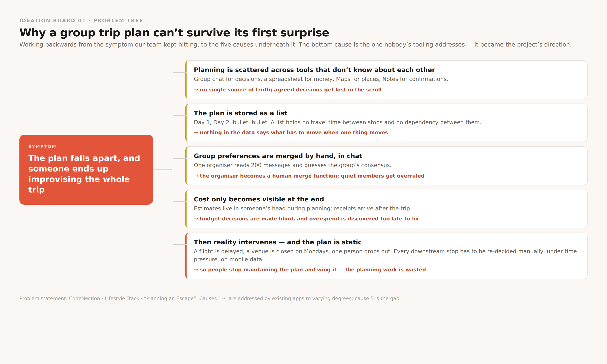
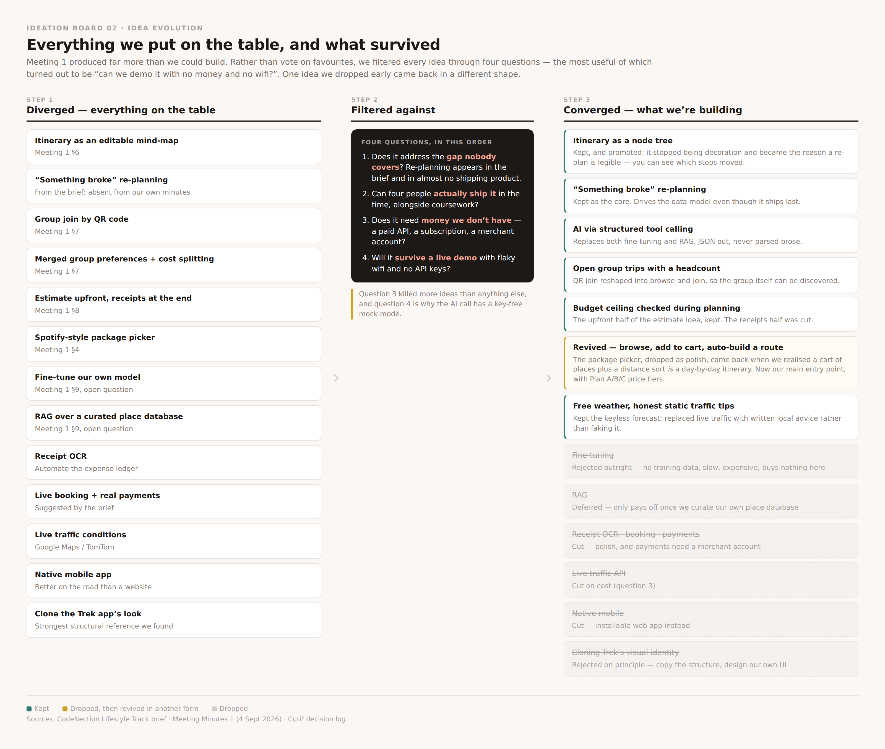

# Cuti² by [Team Name]

**Team:** [Member 1], [Member 2], [Member 3], [Member 4]
**Problem Statement:** Travel Planner — CodeNection Lifestyle Track, "Planning an Escape"
**Video Presentation:** [Unlisted YouTube Link]
**Presentation Slides:** [Public Link]

---

## 1. Project Overview

### The Problem

Planning a group trip is not hard because information is scarce. It is hard because
the plan has no structure that can absorb a change.

Every group has the same shape: one person becomes the organiser. They open a group
chat for decisions, a spreadsheet for money, Google Maps for places, and Notes for
confirmation numbers. None of these four tools knows the others exist. The plan that
results is a **list** — Day 1, Day 2, bullet, bullet — and a list records only what
someone decided, never *why*, never what it depends on, and never how long it takes
to get from one line to the next.

Then reality arrives. The flight slips two hours. The museum turns out to be closed
on Mondays. One person pulls out the night before and the cost split silently changes
for everyone else. Because the plan is a flat list, nothing in it knows that stop
four depends on stop three. So every downstream decision has to be re-made by hand,
under time pressure, on mobile data, by the one person who happens to be holding the
spreadsheet. Most groups give up at this point and improvise — which means the
planning effort was wasted.

We identified five causes, and deliberately targeted the last one:

1. **Planning is scattered** across tools that don't share state, so there is no
   single source of truth.
2. **The plan is stored as a list**, which cannot express travel time between stops
   or dependency between them.
3. **Group preferences are merged by hand**, in chat — the organiser becomes a human
   merge function, and quieter members get overruled by whoever replies most.
4. **Cost only becomes visible at the end**, so budget decisions during planning are
   made blind.
5. **The plan is static when things break** — and things always break.

**Stakeholders.** The primary user is the *organiser* — in our case Malaysian
students and young working adults planning domestic group trips, who absorb most of
the coordination work and most of the blame when it goes wrong. The secondary users
are the *participants*, who want visibility and a say without wanting to run a
spreadsheet. Beyond the group, local attractions and small operators are affected
too: when an itinerary collapses, the stops nobody had time to re-plan are the ones
that lose the visit.

> **TODO — strengthen this.** If your team ran any interviews, a poll, or even asked
> friends how their last group trip went, add two or three sentences of what you
> heard here. A reviewer weights one real quote more heavily than a paragraph of
> reasoning.

**Existing apps, and where they stop.**

| App | What it does well | Where it falls short for this problem |
|---|---|---|
| **Wanderlog** | Strong collaborative itinerary building, with maps and shared editing in one place | The itinerary is still a day-ordered list. When one item moves, the user re-drags everything after it themselves — the app has no model of what depended on what |
| **TripIt** | Turns confirmation emails into a single organised itinerary automatically, and can alert on flight changes | It is a *record* of plans, not a planner. It can tell you your flight is delayed; it will not rebuild the rest of your day around the delay, and it has no view of the group's budget or preferences |
| **Google Maps saved lists** | Effortless place saving, excellent place data, works offline | A list of pins with no order, no travel time between them, no cost, and no notion of a trip at all — the structure has to be rebuilt in the user's head every time |

The common gap: all three help you *write down* a plan. None of them help you
**recover** one. Re-planning is explicitly named in the problem statement and is the
piece almost no shipping product does well — that is the gap we took.

> **TODO — verify before submitting.** Open each app and confirm these descriptions
> still match what it does today; competitor features change, and a reviewer who uses
> Wanderlog will notice an unfair claim.

### Our Solution

> **TODO — not yet written.** 3–4 sentences on what Cuti² is, then the feature list.
> Pull the feature list from `project_info.md` → Core Functionalities.

---

## 2. Ideation & Process

### 2.1 Ideas We Considered

Chosen ideas first, then everything we dropped and why.

| Idea | Why it was kept / dropped |
|---|---|
| **Itinerary as a node tree, not a list** *(Chosen)* | **Kept, and promoted.** It started as a nice-looking mind-map UI from Meeting 1 §6. We kept it once we realised it was not decoration: a tree with parent/child links is the only structure that can answer "what else has to move?", and it is what makes a re-plan *visible* — you can see which stops shifted. |
| **The "something broke" re-plan** *(Chosen)* | **Kept as the core of the project.** The brief names re-planning as one of three hard problems, but it appeared nowhere in our own Meeting 1 minutes, and almost no existing app does it. It ships last but drives the data model from day one. |
| **AI through structured tool calling** *(Chosen)* | **Kept.** The model returns itinerary data as JSON that the app renders directly — never prose we then have to parse. This replaced both of the AI options left open in Meeting 1 §9 and removed the whole class of "the AI replied in the wrong format" bugs. |
| **Browse → add to cart → auto-built route** *(Chosen)* | **Dropped, then revived.** Originally the "Spotify-style package picker" (Meeting 1 §4), cut as polish. It came back when we realised a cart of places plus a distance sort *is* a day-by-day itinerary. It is now our main entry point, with Plan A/B/C price tiers on top. |
| **Open group trips with a headcount** *(Chosen)* | **Kept, reshaped.** Meeting 1 §7 proposed joining a group by QR code. We widened it: a trip owner opens their trip with a target headcount and others browse and self-join. Same goal — get the group in without a chain of email invites — but the group itself becomes discoverable. |
| **Budget ceiling checked during planning** *(Chosen)* | **Half kept.** Meeting 1 §8 proposed estimate-upfront plus receipts-at-the-end. We kept the upfront half as a per-trip budget cap that the re-planner must respect, and cut the receipts half. Knowing a change breaks your budget *before* you accept it is the useful half. |
| **Free weather + written local traffic tips** *(Chosen)* | **Kept in a reduced form.** A keyless forecast API costs nothing, so the weather is real. Live traffic needs a paid API, so rather than fake it we show written, destination-specific advice and say plainly that it is not live data. |
| Fine-tuning our own model | **Rejected outright.** We have no training data, it is slow and expensive, and it buys nothing for this use case — the task is constraint-satisfaction over a handful of stops, not a style or domain the base model lacks. Marked "do not revisit". |
| RAG over a curated place database | **Deferred.** Only pays off once we have curated our own place database worth retrieving from. Until then it is pure overhead on a hackathon timeline. |
| Receipt OCR | **Cut from MVP.** Polish. It makes an existing feature more convenient; it does not make anything possible that wasn't. |
| Live booking APIs and real payments | **Cut.** Real payments need a merchant account we cannot get in time, and booking integrations would consume the whole build for a feature the brief lists as optional. |
| Live traffic conditions (Google Maps / TomTom) | **Cut on cost.** Both are paid. We were not willing to build a core feature we could not afford to run during judging. |
| Native mobile app | **Cut.** An installable web app gets us most of the on-the-road benefit for a fraction of the build, and keeps one codebase. |
| Cloning the Trek app's visual identity | **Rejected on principle.** Trek was our strongest structural reference and we studied its structure deliberately — but we designed our own UI rather than copying its look. |

We filtered every idea above through four questions, in order: does it address the
gap nobody covers; can four people actually ship it alongside coursework; does it
need money we don't have; and will it survive a live demo with flaky wifi and no API
keys. Question three eliminated more ideas than anything else, and question four is
why our AI call has a key-free mock mode.

### 2.2 Ideation Boards

**Board 01 — Problem tree.** We worked backwards from the symptom we all recognised
("the plan falls apart and someone improvises the whole trip") to the five causes
underneath it, so we could pick a cause to attack rather than a feature to build.
Causes 1–4 are already served by existing apps to some degree; cause 5 is the one
that is structurally unsolved, and it became the project's direction.

**Board 02 — Idea evolution.** Meeting 1 generated far more than four people could
build. Rather than vote on favourites, we ran every idea through the same four
filter questions and recorded the outcome, including the ideas we killed. The
yellow card is worth noting: the package picker was dropped early as polish, then
revived in a different form once we saw that a cart of places plus a distance sort
is already an itinerary.

> **TODO — add your real working artefacts.** These two boards were drawn up from the
> team's decision log, so they are tidy. **Photos of your actual whiteboard, paper
> scribbles, or the messy first mind-map are more convincing than clean diagrams** —
> the template explicitly says messy is fine and that reviewers want to see how the
> team thought, not a polished result. Drop any photos into `docs/ideation/` and add
> them here with a line each. Two tidy boards plus two real photos beats four tidy
> boards.

### 2.3 Mentor Consultation

> **TODO — needs an actual meeting.** This is the only section that depends on
> someone outside the team, so it has the longest lead time. Book it now.

| Date | Mentor | Feedback Received | What Was Changed |
|---|---|---|---|
| | | | |

Disagreeing with feedback is allowed — say so and explain why. It still counts as
engaging with it.

---

## 3. Design & Prototype

> **TODO.** Needs a public link that opens in an incognito window, plus 4–8 key
> screens as images with a caption each explaining the interaction.

---

## 4. What Makes It Different

Cuti² differs from the apps in section 1 in one structural way, and several
consequences follow from it.

**1. The itinerary is a dependency tree, not a list.**
Every stop is a node with a parent. This is the original decision the whole project
rests on. Because the structure records what follows what, the app can compute the
set of stops affected by a change instead of asking the user to work it out. Every
app named in section 1 stores a day-ordered list, which is why none of them can do
the next item.

**2. A "something broke" button that re-flows only the affected branch.**
Mark any stop as broken and give a reason — delayed, closed, someone dropped out.
The app walks the tree to find everything downstream, sends that subtree plus the
trip's budget ceiling to the model, and gets back a proposed re-plan. **The twist is
that it is a proposal, not an action:** you see a diff of exactly what would be
cancelled, moved, or inserted, and what it does to your budget, and you accept or
reject it. TripIt can tell you the flight is late; this rebuilds the rest of the day
around it and shows you the bill first.

**3. The AI proposes; it never writes to the database.**
The model call runs in an Edge Function that returns a validated proposal and
nothing else. Every actual write goes through the app's normal, permission-scoped
data layer, and every proposal is recorded — request and response — whether or not
it was applied. This is a deliberate trust boundary rather than a limitation: the
model cannot corrupt a trip even if it returns nonsense, and there is an audit trail
of what it suggested.

**4. Structured output, so there is no prose to parse.**
The model is forced to reply in a fixed schema, and the response is validated against
the trip's real stop IDs before anything is shown. Malformed or hallucinated stops
are rejected at the boundary instead of reaching the UI.

**5. A shopping cart that turns into a route.**
Browse a state, add places you like, and the app orders them geographically and packs
them into days against an hours-per-day budget. The twist: most planners make you
choose places *and* sequence them. Here, choosing is the whole job — the sequencing
is computed. Plan A/B/C price tiers let you start from a budget instead of a blank
canvas.

**6. Group trips you can discover and join, not just be invited to.**
Instead of emailing invitations one at a time, an owner opens a trip with a target
headcount and others browse open trips and join in one click until it is full. This
turns the group-forming step inside out — you can find a trip rather than needing to
already know the organiser.

**7. It degrades honestly.**
With no AI key configured the re-planner runs in a mock mode that still exercises the
full break-and-review flow, so the demo cannot break. Weather is real because a free
API exists; traffic is written local advice, clearly labelled as not live, because
the real thing costs money we don't have. We would rather show a working honest
feature than a fake impressive one.

**8. Malaysia first.**
Prices in MYR by default, and a curated local catalogue rather than a thin global
one. "Cuti-cuti" reads instantly to the audience we are building for.

**Where this stands today:** items 1–6 are built and running locally; item 7 is
built; the cheap intent-gate for off-topic AI questions is designed but not yet
implemented. Section 5 sets out what the build phase completes.

> **NOTE — this section describes the Cuti² prototype on the `wenhung` branch.** Your
> team has several prototypes in the repo. If the team submits a different one, this
> section and the video script both need rewriting against that feature set.

---

## 5. Technical Architecture & Feasibility

> **TODO.** Tech stack with a reason and an expected constraint for each choice,
> optional architecture diagram, and an explicit build plan for the 3-week build
> phase. Source material is in `project_info.md`.
