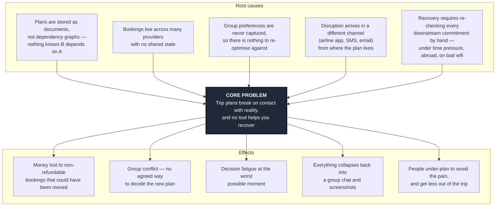

# 01 · Problem Analysis

> Challenge statement: *Lifestyle Track — Planning an Escape (Travel Planner)*

## 1. The core problem, stated precisely

The brief describes three pains: fragmentation, group coordination, and mid-trip change.
Most teams will attack fragmentation, because it is the most visible. We think it is the
least important, and here is why.

Fragmentation is a **solved** problem. Mature tools already consolidate flights, stays,
budgets and itineraries into one place (see `04-competitive-analysis.md`). What no tool
does well is the third pain, which the brief states plainly:

> "when something changes mid-trip, there's rarely any real help from existing platforms
> in adjusting."

So we restate the problem as:

**Trip plans are brittle. They are built as static documents, but a trip is a dependency
graph — and when one node breaks, nothing helps you repair the rest.**

A delayed flight is not one problem. It is one cause with a *cascade*: the airport
transfer is now wrong, the hotel check-in window is missed, the tour booked for 16:00 is
gone, the restaurant reservation is unreachable, and the person holding the booking
reference is asleep. Existing tools will happily show you all five broken things. None of
them will fix them.

## 2. Problem tree

The two causes we can actually act on are **C1** and **C3**. If a plan is stored as a
graph with real dependencies, and if we know what each traveller values, then recovery
becomes a solvable optimisation instead of a group argument. C2 and C4 need commercial
integrations we cannot get in a hackathon — we design for them and say so.

## 3. Stakeholders

| Stakeholder | What they care about | How disruption hits them |
|---|---|---|
| **The organiser** (1 per group) | Not being blamed | Absorbs all the re-planning work, alone, in real time |
| **The other travellers** | Their own priorities surviving the change | Get a new plan handed to them with no say; resentment |
| **The budget-constrained member** | Not overspending | Recovery options usually cost more; too awkward to object out loud |
| **Venues and operators** | Filled slots | Lose a booking that a 20-minute nudge could have rescheduled |

The organiser is the one who feels the pain sharply enough to install something. They are
our wedge.

## 4. Target user

The rubric rewards a specific user, not "everyone". Ours:

> **Groups of 3–6 friends, roughly 20–35, on self-booked regional trips of 3–7 days,
> with mixed budgets and no professional planner among them.**

Why this group specifically:

- **Highest coordination cost.** Past ~3 people, preferences genuinely conflict and the
  "just decide in the group chat" strategy stops working.
- **Most exposed to disruption.** Budget carriers, tight connections, cheap non-refundable
  bookings — the exact profile where a delay does the most damage.
- **Worst tooling.** They are not a corporate travel account. They have a spreadsheet, a
  group chat, and one exhausted organiser.
- **Nameable pain.** "Organiser burnout" is a thing this group recognises immediately when
  you say it out loud. That matters for a pitch.

Secondary user: the **solo traveller** who wants the same safety net. Same engine, simpler
case — the group-preference step collapses to one profile. We support them for free, which
answers the brief's "works well whether someone's travelling solo or with a group."

Explicitly *not* our user (for now): business travel, package-tour customers, and
multi-month backpackers. Different constraints, different product.

## 5. What success looks like

A concrete before/after we can demonstrate on stage:

| | Without us | With us |
|---|---|---|
| Time to a workable new plan | 40–90 min of group chat | Under 2 minutes |
| Who does the work | The organiser, alone | The app proposes, the group confirms |
| Budget visibility | Discovered later, painfully | Cost delta shown before you commit |
| Whose preferences survive | Loudest voice | Explicit, and the tradeoff is named |
