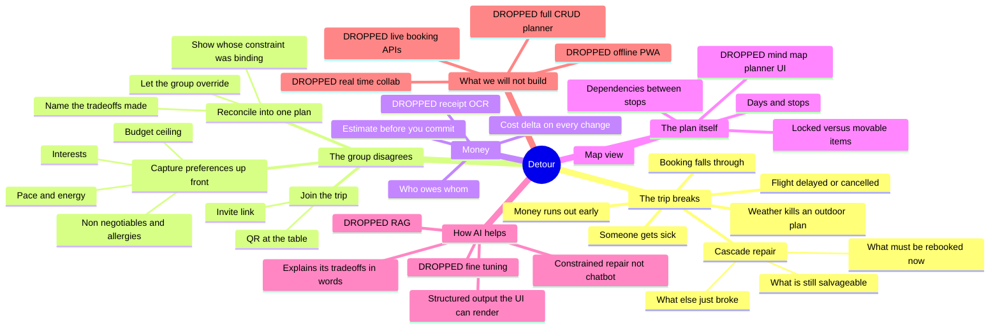

# 02 · Ideation — Mindmap and Breadth of Exploration

> Working name: **Detour**. Provisional — the team has not locked a name yet.
> It was chosen because it names the product's job (an unplanned change of route
> that still gets you there) rather than the category (planning).

## 1. Ideation mindmap

This is the full space we explored before narrowing. Branches we dropped are marked
DROPPED and the reasoning is in `03-iteration-log.md`.

## 2. Breadth of exploration — the five ideas we weighed

We generated five distinct products against this brief before choosing. These are not
variations of one idea; they target different users and different pains.

### Idea A — The consolidator
One app holding flights, stays, budget, itinerary and documents. The "everything in one
place" play. *This was our Meeting 1 direction.*

### Idea B — The group matcher
Swipe-to-agree. Each member swipes on destinations and activities; the app finds the
overlap and builds the itinerary from consensus.

### Idea C — The disruption recovery engine ✅ **CHOSEN**
The plan is a dependency graph. When something breaks, the app computes the cascade and
proposes ranked repairs that respect budget and group preferences.

### Idea D — The budget-first builder
Start from "we have RM2,000 and 4 days" and work backwards to an itinerary, with live
cost tracking as the primary interface.

### Idea E — The settle-up tool
Post-trip only. Photograph receipts, split fairly, settle debts. Narrow and useful.

## 3. Decision matrix

Scored 1–5. Weights reflect the judging rubric plus our one-week constraint.

| Criterion (weight) | A · Consolidator | B · Matcher | **C · Recovery** | D · Budget-first | E · Settle-up |
|---|:---:|:---:|:---:|:---:|:---:|
| Differentiation from existing tools (×3) | 1 | 3 | **5** | 2 | 1 |
| Directly answers the brief's stated gap (×3) | 2 | 3 | **5** | 2 | 1 |
| Demonstrable in one week (×2) | 1 | 4 | **4** | 3 | 5 |
| Depth of real user pain (×2) | 3 | 3 | **5** | 3 | 2 |
| AI is necessary, not decorative (×1) | 1 | 3 | **5** | 2 | 1 |
| **Weighted total (max 55)** | **19** | **34** | **∗ 50** | **25** | **19** |

### Why each one lost

- **A · Consolidator — 19.** Mature open-source tools already do this to a depth we cannot
  approach in a week (`04-competitive-analysis.md`). We would be scored against them and
  lose. It also fails the "AI is necessary" test: consolidation is CRUD with a map.
- **B · Matcher — 34.** Genuinely good, and the runner-up. It solves the group half of the
  brief, but it stops at the planning stage and does nothing once the trip starts — which
  is the gap the brief actually calls out. We kept its best idea (explicit preference
  capture) and folded it into C as an input to the repair engine.
- **D · Budget-first — 25.** Interesting framing, but budget tracking is a feature of every
  existing planner. Not enough to build a product on.
- **E · Settle-up — 19.** Easiest to build, and the most solved. Splitwise-class tools own
  this outright.

### Why C won

It is the only option that scores maximum on both *differentiation* and *fit to the brief*,
and it is the only one where the AI is doing work a rule-based system could not: weighing
incommensurable things (money vs. time vs. whose preference gets sacrificed) and explaining
the tradeoff in language a group can argue with.

It also absorbs the best of B. Preferences are not a separate feature — they are the
objective function the repair engine optimises against. That is the synthesis that made
the idea feel finished.
