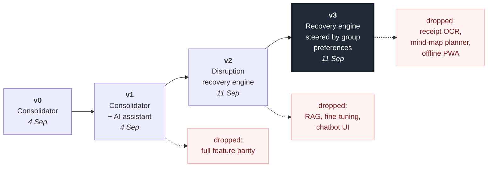

# 03 · Iteration Log

How the idea changed, why, and what we killed along the way.

> **Note for the team:** entries are dated from the meeting minutes and the competitive
> teardown. Fill in attendee names and add any discussion this log does not capture —
> judges reward specificity here.

---

## v0 — "A trip planner that does everything" · 4 Sep

**What it was.** One app for flights, stays, itinerary, budget, group trips and documents.
React + Supabase, Google auth, landing → sign-in → recommendations → plan. TREK cited in
the meeting as "the strongest reference so far."

**Why we started here.** It is the obvious reading of the brief. The brief lists
fragmentation first, and consolidation is the obvious answer to fragmentation.

**What was already right.** The stack (React + Supabase) and the instinct to do a local
version before expanding scope. Both survived every later iteration.

---

## v1 — "…with AI in it somewhere" · 4 Sep

**What changed.** We agreed AI should be part of it, but left *how* open. Two open
questions were recorded: which approach (RAG vs. fine-tuning), and how to stop the AI
answering irrelevant questions and burning tokens.

**Why this mattered more than it looked.** Those two questions were a symptom, not a
detail. You only worry about off-topic questions if you are planning a **chatbot** — a
text box bolted onto a CRUD app. The fact that we could not answer "what is the AI *for*"
was the first real signal that the product had no centre.

---

## v2 — The pivot: "the app that fixes a broken trip" · 11 Sep

Two findings forced this.

**Finding 1 — the reference implementation is four years ahead of us.**
A teardown of TREK (cloned and inspected, not guessed): AGPL-3.0, v4.2.1, 3,053 TypeScript
files, 527,052 lines, 23 languages. It already ships group trips, invite links, real-time
collaboration, cost-splitting with multiple payers and settle-up, receipts on expenses,
maps with route optimisation, an MCP server with 199 tools, and LLM booking extraction.

Every headline feature on our v0 list was already in it, usually in a deeper form. Building
v0 meant competing on execution with a mature product, in six days, and inviting the judges
to ask why they should not just use the original.

**Finding 2 — the gap is in what TREK does *not* do.**
Searching that same codebase for disruption handling returned one incidental match
(unrelated flight-log sync). Searching for group preference reconciliation returned nothing.

Those are exactly the two things the brief singles out:

> "the ability to **re-plan on the fly** if a flight gets delayed or plans fall through"
> "…tools for groups to **combine preferences**"

The most complete travel planner in open source does not do either. That is not an
oversight — they are the hard problems. Everything else is CRUD with a map on it.

**The decision.** Stop building a planner. Build the thing that repairs a plan when it
breaks. Model the trip as a dependency graph so that breaking one node has computable
consequences.

**What this dropped.** Feature parity as a goal. We are no longer trying to match anyone's
checklist.

---

## v3 — Synthesis: preferences as the objective function · 11 Sep

**What changed.** Idea B from our shortlist (a group preference matcher) had been the
runner-up. Instead of discarding it, we folded it in: the preferences it captures become
the thing the repair engine *optimises against*.

This is what turned two decent features into one product. Without preferences, a recovery
engine can only rank options by cost and time — which is a calculator. With them, it can
say:

> "Option 2 costs RM40 more but keeps the cooking class Ali flagged as a must-do.
> Option 3 is cheapest but drops it. Sarah's RM800 ceiling rules out Option 1 entirely."

That sentence is the product. It is also the demo.

**What this dropped, and why:**

| Dropped | Reason |
|---|---|
| **RAG** | Needs a corpus. Our trip data is small and structured; it fits in the prompt. Retrieval solves a problem we do not have. |
| **Fine-tuning** | Needs a labelled dataset we cannot build in a week, and solves the wrong problem — we reason over *this trip's* rows, not world facts. |
| **Chatbot UI** | Killed the "irrelevant questions" problem by construction. Every AI call fires from a button with a fixed template and a strict output schema. No open text box means off-topic input is structurally impossible. This is a design answer, not a model answer. |
| **Receipt OCR** | Post-trip accounting. Orthogonal to the thesis, and already solved by Splitwise-class tools. |
| **Mind-map planner UI** | Expensive to build, adds nothing to the repair story. Survives as a mockup only. |
| **Offline PWA, real-time collab, live booking APIs** | Right for a product, wrong for a six-day prototype. Named as roadmap, not pretended away. |
| **QR code as a headline feature** | It is a URL with a picture around it. Kept as a convenience; removed from the pitch as a differentiator. |

---

## What we would do with another month

In rough priority order: live booking and pricing APIs so recovery options are bookable
rather than suggested; push notification the moment a carrier files a delay, so the app
tells *you*; learning each traveller's revealed preferences across trips; and offline
support, because the moment you most need this is the moment you have the worst connectivity.
