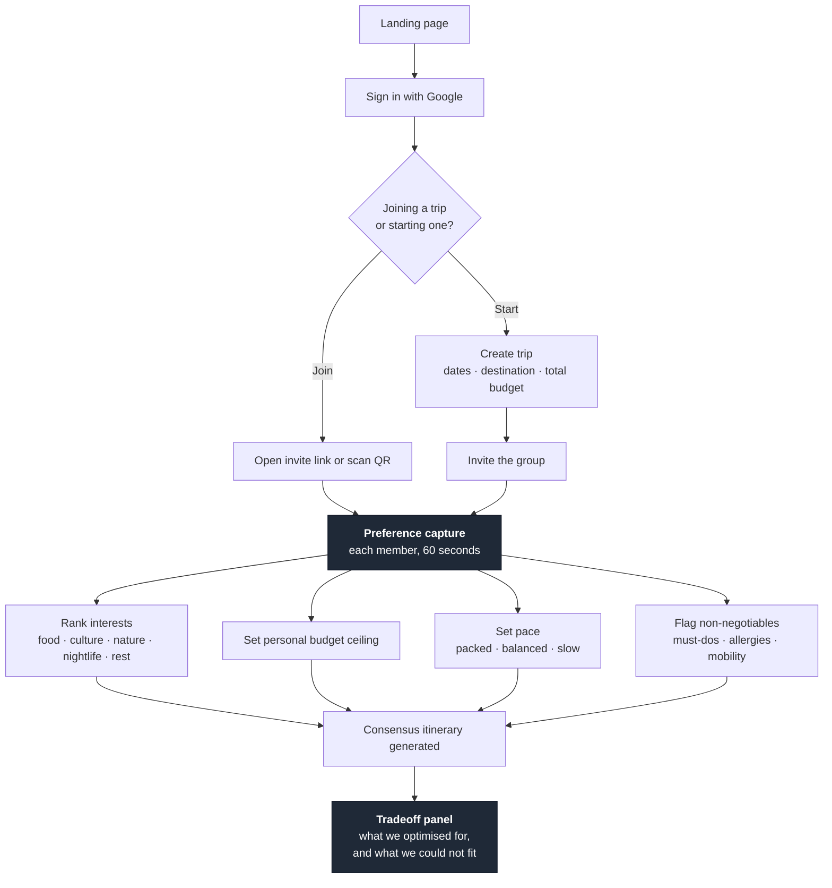
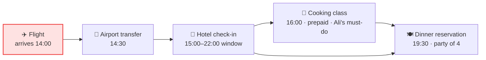
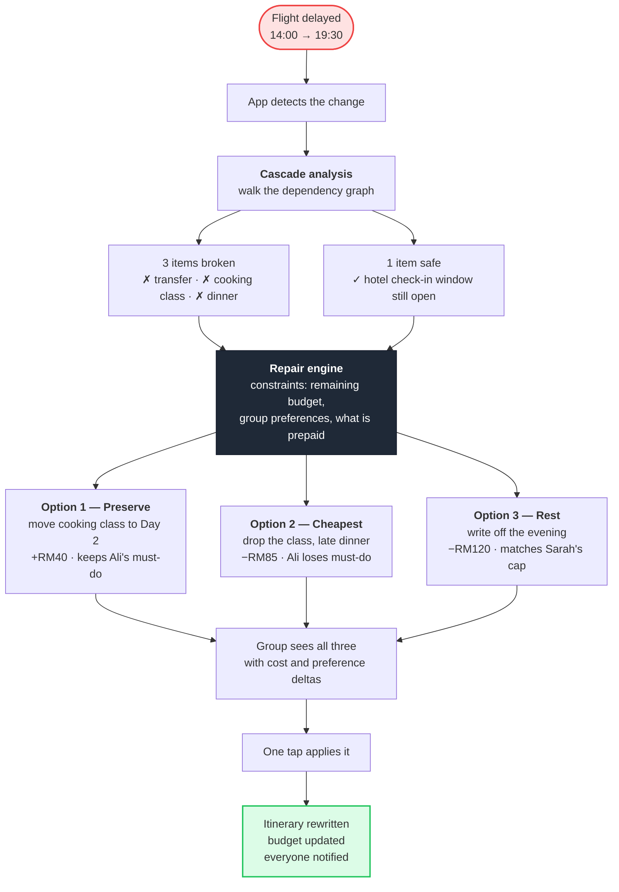

# 05 · User Flows

Three flows. Only the third is the product — the first two exist to set it up.

## 1. Onboarding and preference capture

The **tradeoff panel** is the part no competitor has. The app does not just merge
preferences — it reports what it could not satisfy and whose constraint was binding.
That turns an invisible algorithmic decision into something a group can argue with, which
is the only way a group actually accepts it.

## 2. The trip, as a dependency graph

This is the data model that makes everything else possible, drawn as the user sees it.

Every edge is a real dependency. Because the app knows them, a change at the flight node
has *computable* consequences — it does not need to guess what else is affected, and
neither does the user.

## 3. The disruption flow — the demo

### Why this is the whole pitch

The three options are deliberately not ranked by a single number. They represent three
*different values* — preserve what matters most, spend least, protect everyone's energy.
A calculator cannot produce that set. It requires weighing things that do not share a unit,
and explaining the weighing in words the group can push back on.

That is what the AI is for. It is also why there is no chat box anywhere in this flow.

## 4. Screen inventory for the prototype

| # | Screen | Build | Priority |
|---|---|---|---|
| 1 | Landing | Static, minimal | P2 |
| 2 | Preference capture | Real, 4 inputs | **P0** |
| 3 | Trip view with dependency graph | Real, seeded data | **P0** |
| 4 | Cascade view — what just broke | Real | **P0** |
| 5 | Recovery options — 3 ranked cards | Real, live Claude call | **P0** |
| 6 | Applied state — updated itinerary and budget | Real | **P0** |
| 7 | Mind-map planner | **Mockup only** | P3 |

P0 screens are the demo. If time runs short, everything else is a mockup.
