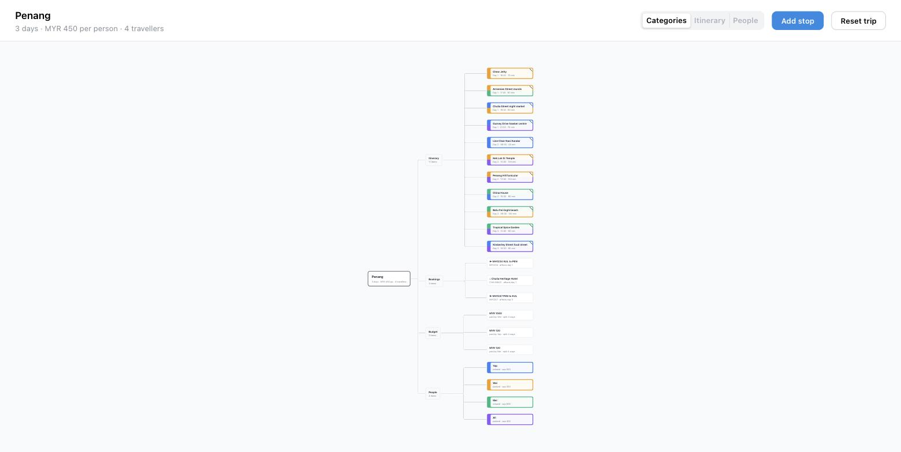
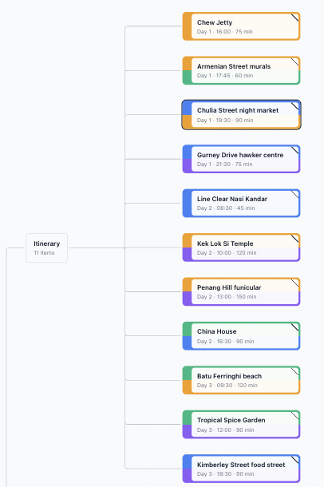
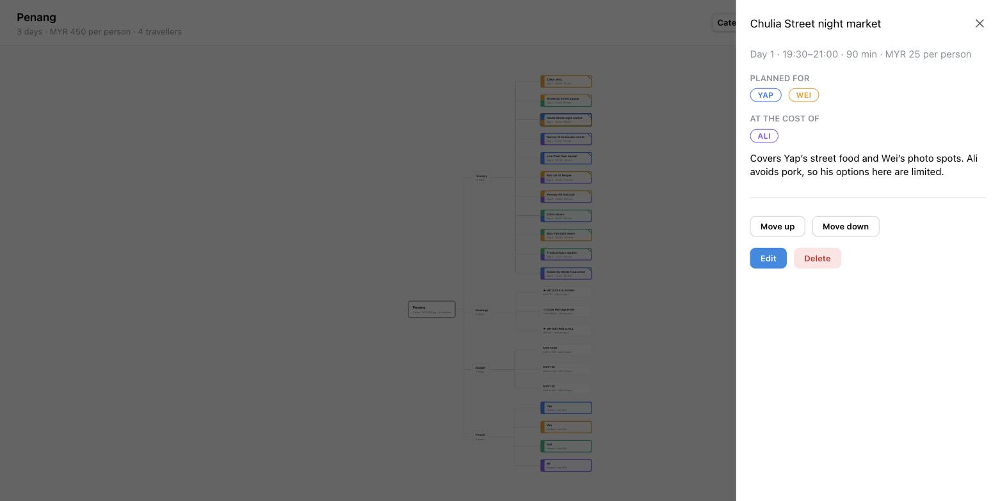
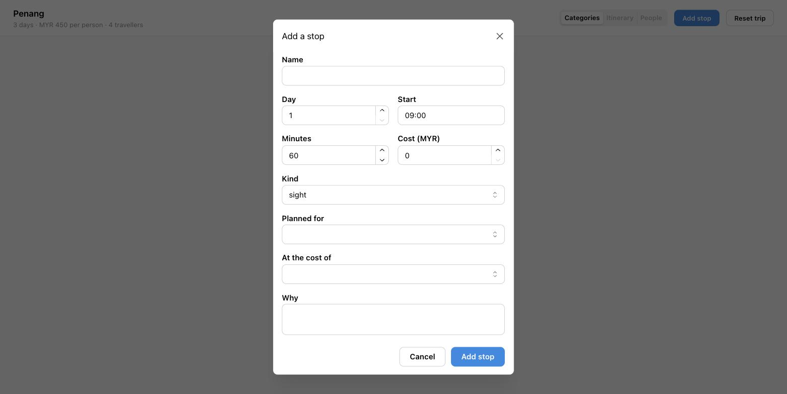
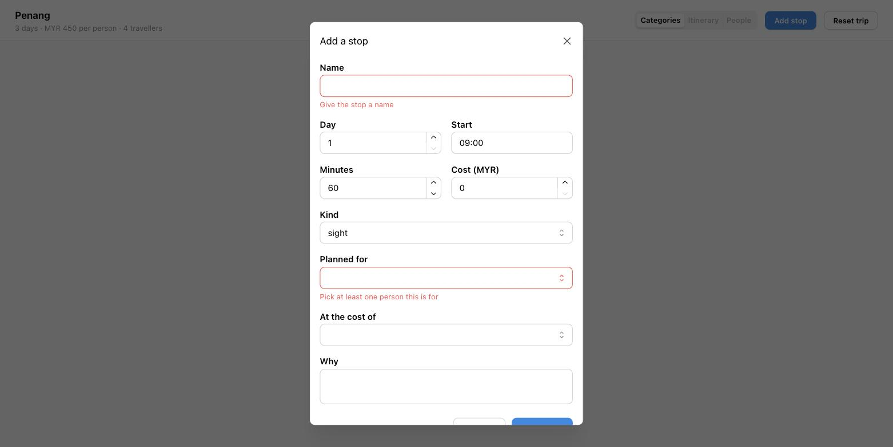

# How to use the Penang Trip Planner

A walkthrough of every screen and control in the prototype. Written for someone opening it for the first time — a teammate, a mentor, or a judge.

---

## 1. Running it

```bash
npm install     # first time, or if node_modules is missing
npm run dev
```

Then open **http://localhost:5173**. Leave the terminal running; the site is only live while it is.

> If you see `sh: vite: command not found`, `node_modules` is missing or empty. Run `npm install` and try again.

---

## 2. What you are looking at



The whole trip is one mindmap. There are no tabs and no pages — everything lives on this single canvas.

- **Centre:** the trip itself (Penang, 3 days, MYR 450 per person, 4 travellers)
- **Four branches:** Itinerary, Bookings, Budget, People
- **Leaves:** individual stops, flights and hotels, budget lines, and travellers

You can **drag the background** to pan and **scroll** to zoom. The map fits itself to the window when the page loads and when you resize.

### Reading the colours



This is the part worth understanding, because it carries the whole idea.

- **The coloured band on the left of each stop is made of the people that stop is for.** One colour means one person; two stacked colours mean two people. Solid orange is Wei alone. Blue over orange is Yap *and* Wei.
- **The diagonal slash in the top-right corner means somebody lost out on this stop.** It is deliberately a neutral grey slash, not a red warning — a compromise is a normal part of a group trip, not an error.
- Each traveller keeps the same colour everywhere in the app, including in the People branch and on the detail panels.

So before you read a single word, you can tell whose day Tuesday is, and where the friction is.

---

## 3. Opening a stop

Click any node to open its detail panel on the right.



The panel gives you:

- **Time slot, duration and cost** — `Day 1 · 19:30–21:00 · 90 min · MYR 25 per person`. The end time is calculated, not stored.
- **Planned for** — the travellers this stop was chosen for, as chips in their own colours
- **At the cost of** — who is compromising, and a plain sentence explaining why: *"Covers Yap's street food and Wei's photo spots. Ali avoids pork, so his options here are limited."*
- **Move up / Move down / Edit / Delete** — the controls covered below

Click the **×**, press **Escape**, or click the background to close it.

Bookings, budget lines and travellers all open too, each with its own detail: a flight shows its reference and times, a budget line shows who paid and how it splits, a traveller shows their pace, budget cap, must-haves and things they avoid.

---

## 4. Changing the plan

All four editing controls live in the stop's detail panel.

### Reorder within a day

**Move up** and **Move down** swap a stop with its neighbour *in the same day*. The node visibly changes position on the map.

Two things to know:
- A stop can never move out of its day this way. To change days, use Edit.
- At the first or last stop of a day, the buttons do nothing. There is no message — this is a known rough edge.

### Edit

**Edit** turns the panel into a form with every field: name, day, start time, duration, cost, kind, who it is for, who it costs, and the explanation sentence. **Save** applies it, **Cancel** discards it.

Changing the **day** moves the stop to the end of its new day and closes the gap in the old one, so the ordering within both days stays correct.

### Delete

**Delete** removes the stop immediately — there is no confirmation dialog. The panel closes and the remaining stops in that day renumber themselves. Use **Reset trip** if you delete something by mistake.

---

## 5. Adding a stop

Click **Add stop** in the top right.



| Field | Notes |
|---|---|
| **Name** | Required |
| **Day** | Must be 1–3 for this trip |
| **Start** | 24-hour `HH:MM`. `09:30` is valid, `9:30` is not |
| **Minutes** | Must be more than zero |
| **Cost (MYR)** | Per person. Zero is fine, negative is not |
| **Kind** | food, sight, nature, cafe, or market |
| **Planned for** | **At least one person is required** |
| **At the cost of** | Optional. Cannot include anyone who is already in "Planned for" |
| **Why** | The sentence shown on the detail panel |

The new stop is added to the end of its day, and its panel opens straight away so you can check it.

### If something is wrong



The form reports **every problem at once** rather than one at a time, and the dialog stays open. Two rules are worth calling out:

- **A stop must serve at least one person.** A stop nobody wants is exactly the problem this app exists to prevent, so it cannot be saved.
- **Clearing a number field blocks the save.** If you empty the Day box and submit, you get *"Day must be between 1 and 3"* rather than a silent save as day 1.

---

## 6. Resetting

**Reset trip** restores the original 11-stop Penang itinerary and discards everything you have changed. Use it before recording a demo so every take starts identically.

---

## 7. What is saved

Everything you change is stored in your browser's local storage and survives a reload or a browser restart.

Two things deliberately do **not** come back after a reload: whichever stop you had selected, and which lens you were on. The app always opens on a clean map with nothing selected.

There is no account and no server — the data never leaves your machine, and it is per-browser. Opening the app on another device gives you the original trip again.

---

## 8. Known limits of this prototype

Honest list, so nobody is surprised in a demo:

- **Itinerary and People lenses are greyed out.** Only the Categories lens is built. The other two are in the build phase.
- **No delay re-planning yet.** "Flight delayed 3 hours" is the headline feature and is not built.
- **New stops all get the same coordinates** (George Town), because map-picking arrives with the map view.
- **Bookings, budget lines and travellers are read-only.** Only stops can be edited.
- **Desktop browsers only.** No mobile layout.
- **Move up / Move down give no feedback** at the ends of a day.
